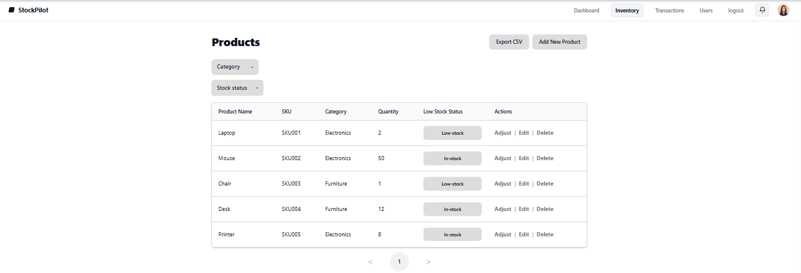

# Inventory List

> Path: **Inventory**

Browse, filter, and manage all products.

## Features
- **Filters** – by **Category** and **Stock status** (In-stock / Low-stock / Out-of-stock)
- **Low-stock badge** – shows when `quantity ≤ low_stock_threshold`
- **Actions** per row:
  - **Adjust** – open stock change modal
  - **Edit** – edit product details
  - **Delete** – soft delete product
- **Export CSV** – download current view
- **Add New Product** – open create form
- **Pagination** – navigate result pages
