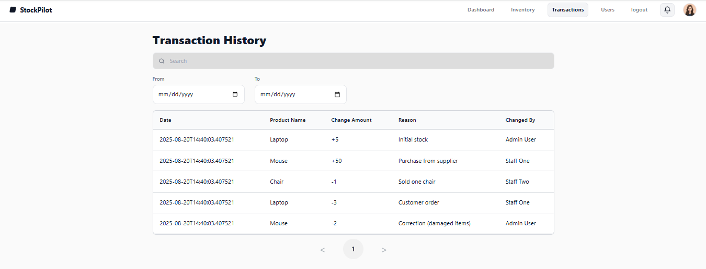

# Transaction History

> Path: **Transactions**

A chronological log of stock changes.

## Features
- **Search** by product name/SKU
- **Date range** filter (From / To)
- Table columns:
  - **Date** – timestamp
  - **Product Name**
  - **Change Amount** – positive (+) for restock, negative (−) for deduction
  - **Reason** – e.g., “Purchase from supplier”, “Customer order”
  - **Changed By** – user who performed the change
- **Pagination** for large logs

## Notes
- Rows are created automatically when stock is adjusted or edited
