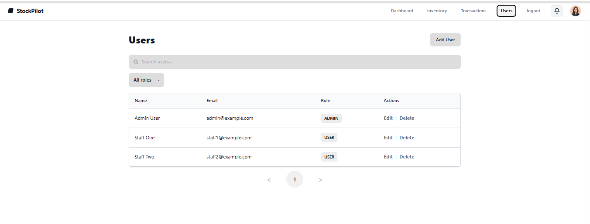

# Users List

> Path: **Users**

Manage system users and roles.

## Features
- **Search** by name/email
- **Filter by role** (All / ADMIN / USER)
- Per-user **Actions**:
  - **Edit** – modify name, role, or email
  - **Delete** – remove user
- **Add User** button to create new accounts
- **Pagination** for long lists

## Permissions
- Only Admins can access Users management
